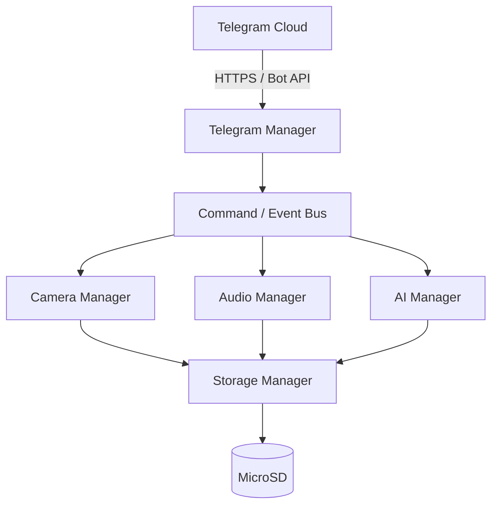

# TelegramP4

**Control an ESP32-P4 AI Camera from Telegram.**

> ⚠️ Status: project scaffolding stage. Firmware phases have not been implemented
> yet — see [docs/PHASES.md](docs/PHASES.md) for the build plan and
> [CLAUDE.md](CLAUDE.md) for current progress.

## 1. What is TelegramP4?

TelegramP4 turns a DFRobot FireBeetle 2 ESP32-P4 AI Vision Board into a
Telegram-controlled smart camera: take photos, record video, run on-device AI object
detection, get motion alerts, and control GPIOs — all from a Telegram chat. It's built
as an incremental, beginner-friendly learning platform: each feature is its own
lesson and its own firmware phase, so you can follow along from "hello world" to a
full AI security camera.

## 2. Features (target — see roadmap for current state)

- Wi-Fi connectivity with auto-reconnect
- Telegram bot control: commands + inline buttons
- Photo capture and delivery to Telegram
- Video recording and delivery
- MicroSD storage with a photo/video/audio gallery
- Receiving photos and voice messages from Telegram
- Audio recording and playback delivery
- Voice-command control (speech-to-text → camera/action)
- On-device AI object detection (ESP32-P4 edge AI)
- PIR motion detection with AI-filtered Telegram alerts
- Whitelisted GPIO control (LEDs, relays, buzzers, sensors)
- Optional MIPI-DSI display with live status/preview
- OTA firmware updates
- Chat-ID whitelist, TLS-only Telegram traffic, no secrets in Git

## 3. Hardware

- **DFRobot FireBeetle 2 ESP32-P4 AI Vision Board** — https://www.dfrobot.com/product-2915.html
  - ESP32-P4 main processor
  - ESP32-C6 connectivity co-processor (Wi-Fi/BLE)
  - MIPI-CSI camera
  - MicroSD slot
  - Onboard microphone
  - Optional MIPI-DSI display
- Optional: PIR motion sensor, relay/LED/buzzer for GPIO demos

See [docs/hardware.md](docs/hardware.md) for verified pinouts and specs (filled in
during Phase 0/5/7/11/17/19/20 as each subsystem is verified against real
documentation).

## 4. Wiring

Covered per-lesson in [docs/lessons/](docs/lessons/) as each peripheral is added.
No generic wiring diagram yet — the camera/SD/mic are onboard; PIR/relay/LED wiring
is documented in the Phase 17/19 lessons.

## 5. Software requirements

- [ESP-IDF](https://github.com/espressif/esp-idf) (version targeting `esp32p4`
  support — confirmed during Phase 0)
- Python 3 (installed by the ESP-IDF installer)
- A Telegram account and bot token (see below)
- Git

## 6. Install ESP-IDF

Follow the official Espressif "Get Started" guide for your OS, then confirm:

```bash
idf.py --version
idf.py --list-targets
```

`esp32p4` must appear in the target list.

## 7. Create a Telegram bot

See [docs/telegram-bot-setup.md](docs/telegram-bot-setup.md).

## 8. Configure Wi-Fi

```bash
idf.py menuconfig
```

Set your SSID/password under `TelegramP4 Configuration → WiFi`. This is stored in
your local `sdkconfig`, which is gitignored — never commit it.

## 9. Configure the Telegram token

Set your bot token and allowed chat ID(s) under
`TelegramP4 Configuration → Telegram` in `idf.py menuconfig`. See
[docs/configuration.md](docs/configuration.md) for every option.

## 10. Build

```bash
idf.py set-target esp32p4
idf.py build
```

## 11. Flash

```bash
idf.py -p <PORT> flash
```

## 12. First command

```bash
idf.py -p <PORT> monitor
```

Then in Telegram, send `/start` to your bot.

## 13. Camera setup

See [docs/lessons/05-camera.md](docs/lessons/05-camera.md) (added in Phase 5).

## 14. AI setup

See [docs/lessons/15-ai.md](docs/lessons/15-ai.md) (added in Phase 14).

## 15. Troubleshooting

See [docs/troubleshooting.md](docs/troubleshooting.md).

## 16. Architecture

See [docs/architecture.md](docs/architecture.md) for the full module diagram.



## 17. Learning roadmap

22 lessons, one per firmware phase — see [docs/PHASES.md](docs/PHASES.md) for the
build plan and [docs/lessons/](docs/lessons/) for the write-ups as they're published.

## 18. Contributing

See [CONTRIBUTING.md](CONTRIBUTING.md).

## 19. License

MIT — see [LICENSE](LICENSE).
