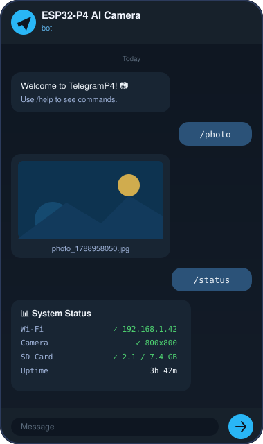
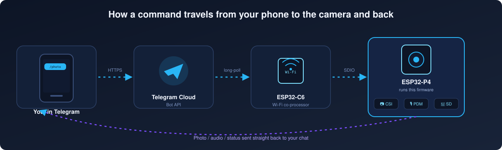
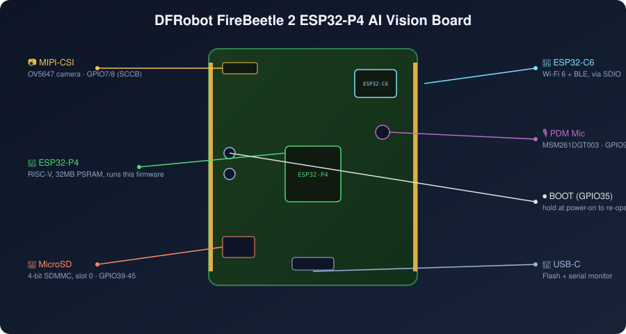
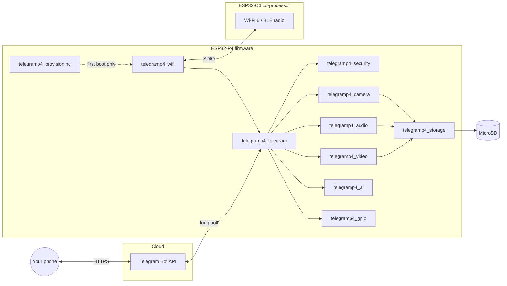

<div align="center">



[](https://github.com/espressif/esp-idf)
[](https://www.espressif.com/en/products/socs/esp32-p4)
[](https://www.dfrobot.com/product-2915.html)
[](LICENSE)
[](docs/hardware.md)

**Take photos, record audio, browse an SD-card gallery, and watch motion alerts — all from a Telegram chat — on a $30 RISC-V board with no native Wi-Fi of its own.**

[Features](#-features) • [How it works](#-how-it-works) • [Quick start](#-quick-start) • [Command reference](#-command-reference) • [Hardware](#-hardware) • [Architecture](#-architecture) • [Docs](#-documentation)

</div>

---

## 📣 Real hardware, really tested

Every ✅ below has been flashed onto a physical [DFRobot FireBeetle 2
ESP32-P4 AI Vision Board](https://www.dfrobot.com/product-2915.html) and
exercised live over Telegram — not just compiled. Where something
_hasn't_ been verified yet, this README says so plainly. The full,
warts-and-all debugging history (including two "hardware defects" that
turned out to be one-line software bugs) is in
[CHANGELOG.md](CHANGELOG.md) and [docs/hardware.md](docs/hardware.md).

## ✨ Features

| | Feature | Status |
|---|---|---|
| 📶 | Wi-Fi with auto-reconnect, via the onboard ESP32-C6 co-processor | ✅ Working |
| 🤖 | Telegram bot: commands, inline-button menu, chat-ID whitelist | ✅ Working |
| 📷 | Photo capture (OV5647 / MIPI-CSI) delivered straight to your chat | ✅ Working |
| 🎥 | Video recording, hardware H.264-encoded | ✅ Working |
| 🎙 | Audio recording from the onboard PDM microphone (WAV) | ✅ Working |
| 💾 | MicroSD storage with a photo gallery — View / Download / Delete | ✅ Working |
| 🌐 | **Web setup dashboard** — flash once, configure Wi-Fi & bot token from any browser | ✅ Working |
| 📥 | Receiving photos & voice notes sent *to* the bot | ✅ Working |
| 🗣 | Voice-command control (speech-to-text → action), pluggable STT provider | ⚙️ Implemented, opt-in |
| 🧠 | On-device AI object detection | ⚙️ Implemented, opt-in |
| 🚨 | PIR motion detection with AI-filtered alerts | ⚙️ Implemented, opt-in |
| 🔌 | Whitelisted GPIO control (LEDs, relays, buzzers) | ✅ Working |
| 🖥 | Optional MIPI-DSI status display | ⚙️ Implemented, unverified panel |
| 🔄 | OTA firmware updates via `/ota <url>` | ✅ Working |
| 🔒 | TLS-only Telegram traffic, chat-ID auth, filename sanitization | ✅ Working |

_⚙️ items are fully coded and build-clean but ship **disabled by default**
behind a Kconfig flag — they need per-user hardware (a PIR sensor, an API
key, a display panel) to actually exercise, so "working" would be an
overclaim until verified against the specific part you attach._

## 🎬 See it in action

<table>
<tr>
<td width="38%" align="center">
<br>
<sub>A real conversation shape — <code>/photo</code> and <code>/status</code></sub>
</td>
<td width="62%" valign="top">

### How it works



1. You send a command (`/photo`, `/record 10`, `/status`, or tap a menu button) in Telegram.
2. Telegram's cloud queues it; the ESP32-P4 long-polls for updates over HTTPS.
3. Since the P4 has no radio of its own, the request rides in over **SDIO** to the onboard **ESP32-C6**, which does the actual Wi-Fi.
4. The P4 runs the command — grabs a frame off the MIPI-CSI camera, records from the PDM mic, reads the SD card — and answers straight back into your chat.

</td>
</tr>
</table>

## 🌐 Quick start

The fastest path from a bare board to a working bot — **no `idf.py
menuconfig` required**:



```bash
git clone https://github.com/manoranjan2050/Telegram-controlled-AI-Camera.git
cd Telegram-controlled-AI-Camera
idf.py set-target esp32p4
idf.py build
idf.py -p <PORT> flash
```

Then:

1. **Power-cycle the board.** With no Wi-Fi/Telegram configuration saved
   yet, it starts a Wi-Fi hotspot named **`TelegramP4-Setup`**.
2. **Connect your phone or laptop to it** (open network, no password).
3. **Open `http://192.168.4.1/`** in any browser. Fill in:
   - Your home Wi-Fi network name & password
   - A Telegram bot token (get one free from [@BotFather](https://t.me/BotFather) — 30 seconds, see [docs/telegram-bot-setup.md](docs/telegram-bot-setup.md))
   - Your Telegram chat ID (message [@userinfobot](https://t.me/userinfobot) to find it)
4. **Tap Save.** The device reboots, joins your Wi-Fi, and connects to your bot.
5. Open Telegram and send `/start`. 🎉

Want to reconfigure later (new Wi-Fi, new bot)? Hold the **BOOT** button
while powering the board on — it re-opens the setup portal without a
reflash.

> Prefer the classic developer workflow? `idf.py menuconfig` under
> `TelegramP4 Configuration` still works exactly as before and takes
> priority-free precedence the moment you flash real values — the setup
> portal only appears on a genuinely unconfigured device. See
> [docs/configuration.md](docs/configuration.md).

## 📋 Command reference

| Command | What it does |
|---|---|
| `/start`, `/help` | Welcome message and command list |
| `/photo` | Capture a photo and send it |
| `/photos` | Browse the on-device gallery (View / Download / Delete buttons) |
| `/video [seconds]` | Record H.264 video and send it |
| `/record [seconds]` | Record audio (WAV) and send it |
| `/files`, `/storage` | List saved files / SD card usage |
| `/delete <file>` | Delete a file (with confirmation) |
| `/ai` | Run on-device object detection on a fresh frame *(opt-in)* |
| `/arm`, `/disarm`, `/motion` | Motion-detection alerting *(opt-in)* |
| `/gpio`, `/gpio_toggle` | Control whitelisted GPIO pins |
| `/status` | Full system dashboard (Wi-Fi, camera, SD, uptime, heap) |
| `/diagnostics` | Deeper runtime diagnostics |
| `/version`, `/ota <url>` | Firmware version / trigger an OTA update *(opt-in)* |
| `/reboot` | Restart the device (with confirmation) |

Send any photo or voice note *to* the bot and it will save it to the SD
card, with buttons to run AI detection on it or delete it.

## 🔧 Hardware

<div align="center">

</div>

- **[DFRobot FireBeetle 2 ESP32-P4 AI Vision Board](https://www.dfrobot.com/product-2915.html)** (SKU: DFR1172)
  — RISC-V dual-core @ 360MHz, 32MB PSRAM, 16MB flash
- **ESP32-C6-MINI-1** connectivity co-processor (Wi-Fi 6 + BLE over SDIO — the P4 itself has no radio)
- MIPI-CSI camera connector — tested with an **OV5647** sensor (Raspberry Pi Camera Module v1.3)
- Onboard **MSM261DGT003 PDM microphone**
- MicroSD slot (4-bit SDMMC)
- Optional MIPI-DSI display, PIR sensor, relay/LED/buzzer for the GPIO demos

Every pin mapping in this repo is **confirmed against DFRobot's own
schematic and spec table**, not guessed — see
[docs/hardware.md](docs/hardware.md) for the full, sourced pinout and the
handful of real hardware surprises that turned up along the way (a
power-gate MOSFET on the SD socket, a boot-order conflict between Wi-Fi
and SD that survived four rounds of pin/power debugging before the actual
one-line fix was found).

## 🏗 Architecture



Each `telegramp4_*` folder under [`components/`](components/) is a
self-contained ESP-IDF component with one job — camera, audio, storage,
security, provisioning, and so on — wired together only in
[`main/app_main.cpp`](main/app_main.cpp). See
[docs/architecture.md](docs/architecture.md) for the full module
breakdown.

## 📚 Documentation

This project doubles as a from-scratch ESP-IDF learning path — every
feature has its own lesson under [docs/lessons/](docs/lessons/), written
as it was actually built (including the dead ends):

| Doc | What's in it |
|---|---|
| [docs/hardware.md](docs/hardware.md) | Sourced pinouts, confirmed vs. unverified peripherals |
| [docs/PHASES.md](docs/PHASES.md) | The 22-phase build plan this firmware followed |
| [docs/lessons/](docs/lessons/) | One write-up per phase — camera, SD, audio, AI, provisioning, and more |
| [docs/configuration.md](docs/configuration.md) | Every Kconfig option, for the menuconfig workflow |
| [docs/telegram-bot-setup.md](docs/telegram-bot-setup.md) | Creating a bot with @BotFather |
| [docs/troubleshooting.md](docs/troubleshooting.md) | Common errors and fixes |
| [docs/security.md](docs/security.md) | The security model (TLS, chat whitelist, filename sanitization) |
| [CHANGELOG.md](CHANGELOG.md) | Every real-hardware bug found and fixed, in detail |

## 🛠 Software requirements

- [ESP-IDF v5.4.1+](https://github.com/espressif/esp-idf) with `esp32p4` target support
- Python 3.11 (ESP-IDF's Kconfig tooling needs it — see a Windows-specific note in [CLAUDE.md](CLAUDE.md) if you hit `confgen` issues on 3.14)
- A Telegram account (bot creation is free and takes under a minute)

## 🤝 Contributing

Issues and PRs welcome — see [CONTRIBUTING.md](CONTRIBUTING.md). If you
get this running on a different ESP32-P4 board, a pinout PR for
[docs/hardware.md](docs/hardware.md) is especially appreciated.

## 📄 License

MIT — see [LICENSE](LICENSE).
