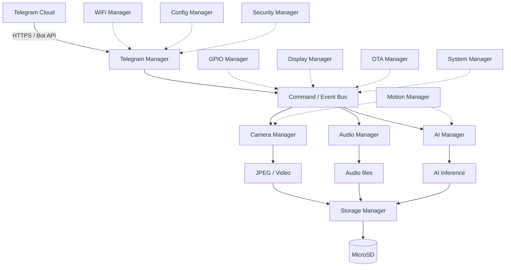

# Architecture

## High-level diagram



## Components

| Component | Responsibility |
|---|---|
| `telegramp4_telegram` | Bot API HTTPS client, long polling, command dispatch, inline buttons |
| `telegramp4_wifi` | STA connection, reconnect, event/state exposure |
| `telegramp4_camera` | Camera init/capture/JPEG |
| `telegramp4_video` | Video recording/encoding |
| `telegramp4_audio` | Microphone capture, audio encode |
| `telegramp4_storage` | MicroSD mount, directory layout, safe file I/O |
| `telegramp4_ai` | AI model load/inference abstraction |
| `telegramp4_motion` | PIR GPIO event → capture/AI trigger, cooldown |
| `telegramp4_gpio` | Whitelisted GPIO control |
| `telegramp4_display` | Optional MIPI-DSI status/preview UI |
| `telegramp4_config` | Kconfig-backed configuration access |
| `telegramp4_security` | Chat-ID whitelist, filename sanitization, rate limiting |
| `telegramp4_ota` | Firmware update via `esp_https_ota` |
| `telegramp4_system` | Status/diagnostics aggregation |
| `telegramp4_board` | Board-specific pin/peripheral definitions |

## Task model

Suggested FreeRTOS tasks (spec §10) — created only where a genuinely independent,
potentially-blocking unit of work exists:

- `telegram_task` — long-poll loop, command dispatch
- `wifi` — driven by the ESP-IDF event loop, not a dedicated task
- `camera_task`, `video_task`, `audio_task`, `ai_task` — created on demand for
  capture/record/inference so they don't block the Telegram task
- `motion_task` — PIR interrupt → debounce → trigger pipeline
- `storage_task` — only if write contention needs serializing; otherwise storage
  calls are made directly with a mutex
- `display_task` — periodic UI refresh, only when display is enabled
- `system_monitor_task` — periodic heap/PSRAM/uptime sampling for `/status`

Communication between tasks uses FreeRTOS queues/event groups, not shared globals.

## Event system

Internal events (spec §11) used to decouple modules:

```
TELEGRAM_CONNECTED
TELEGRAM_MESSAGE_RECEIVED
PHOTO_REQUESTED
PHOTO_READY
VIDEO_STARTED
VIDEO_READY
AUDIO_READY
AI_STARTED
AI_COMPLETE
MOTION_DETECTED
STORAGE_ERROR
CAMERA_ERROR
```

## Design principles driving this architecture

- **Command and button paths converge** on the same handler functions — no
  duplicated business logic (spec §4).
- **Everything is independently testable** where feasible — camera, storage, and AI
  modules should not require Telegram to be running to exercise their core logic.
- **Optional hardware degrades gracefully** — AI and display can be compiled out or
  disabled at runtime without breaking the rest of the firmware.
